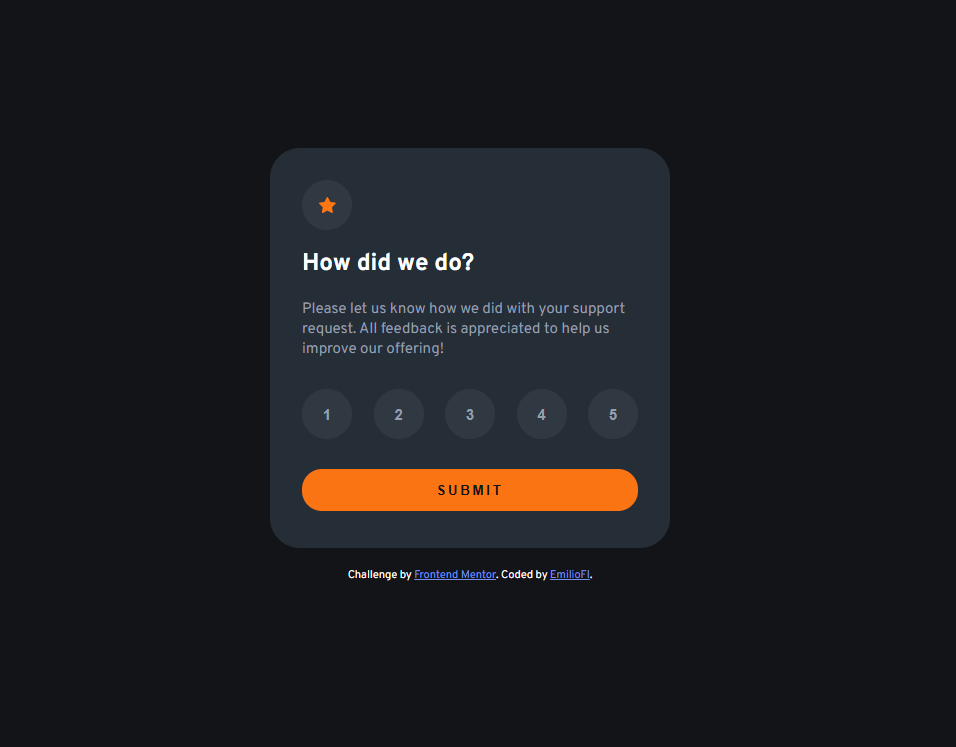

# Frontend Mentor - Interactive rating component solution

This is a solution to the [Interactive rating component challenge on Frontend Mentor](https://www.frontendmentor.io/challenges/interactive-rating-component-koxpeBUmI). Frontend Mentor challenges help you improve your coding skills by building realistic projects.

## Table of contents

- [Overview](#overview)
  - [The challenge](#the-challenge)
  - [Screenshot](#screenshot)
  - [Links](#links)
- [My process](#my-process)
  - [Built with](#built-with)
  - [What I learned](#what-i-learned)
- [Author](#author)

**Note: Delete this note and update the table of contents based on what sections you keep.**

## Overview

### The challenge

Users should be able to:

- View the optimal layout for the app depending on their device's screen size
- See hover states for all interactive elements on the page
- Select and submit a number rating
- See the "Thank you" card state after submitting a rating

### Screenshot



### Links

- Solution URL: [github.com/EmilioFI/FrontEndMentor/tree/main/interactive-rating-component-main/](https://github.com/EmilioFI/FrontEndMentor/tree/main/interactive-rating-component-main/)
- Live Site URL: [emiliofi.github.io/FrontEndMentor/interactive-rating-component-main/](https://emiliofi.github.io/FrontEndMentor/interactive-rating-component-main/)

## My process

### Built with

- Semantic HTML5 markup
- CSS custom properties
- Flexbox
- Mobile-first workflow
- Vanilla JavaScript (DOM manipulation)

### What I learned

I've learnt how to show and hide containers by adding and removing classes, instead of directly "hacking away" at the container's main class like I used to. I think this is a much more elegant and sensible approach.

To see how you can add code snippets, see below:

```html
<h1>Some HTML code I'm proud of</h1>
```

```css
.hidden {
  display: none;
}
```

```js
submitBtn.addEventListener("click", () => {
  if (selectedRating != null) {
    ratingValue.textContent = selectedRating;
    stateStart.classList.add("hidden");
    stateThanks.classList.remove("hidden");
  }
});
```

## Author

- GitHub - [EmilioFI](https://github.com/EmilioFI)
- Frontend Mentor - [@EmilioFI](https://www.frontendmentor.io/profile/EmilioFI)
